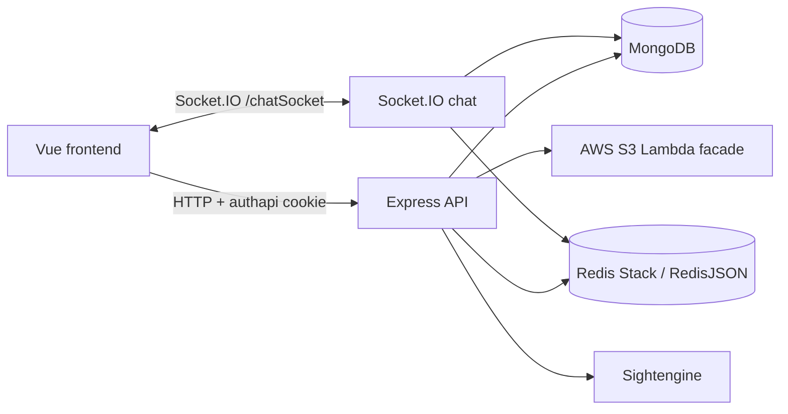
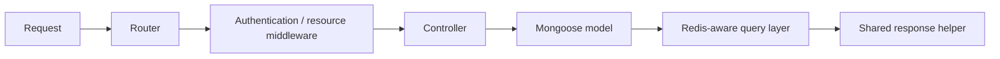

# Architecture and technical decisions

## System context

MYXTRAS is a student social platform split across two repositories:

- **Frontend:** Vue 3 single-page application built with Vite, Pinia, Vuetify,
  and `socket.io-client`.
- **Backend:** CommonJS Node.js application using Express, Mongoose, Redis
  Stack, and Socket.IO.

The browser uses credentialed HTTP requests for most features and a dedicated
Socket.IO namespace for chat. The backend persists canonical application data
in MongoDB, uses Redis JSON structures as an application cache, and delegates
media operations and content moderation to external HTTP services.

## Runtime composition

`server.js` loads environment variables, creates the Express application,
parses cookies, configures credentialed CORS, starts MongoDB and Redis
initialization, enables gamification scheduling, mounts HTTP routers, starts the
HTTP server, and attaches Socket.IO.

All HTTP endpoints are mounted below `/api`. Most feature routers authenticate
requests through `middleware/authMiddleware.js`; public exceptions include
registration, login, uniqueness checks, and the school/course lookup. Admin
routers invoke the same middleware with an additional administrator check.

The recurring request path is:

## Domain modules

| Module | Implemented responsibility | Principal records |
| --- | --- | --- |
| `user` | registration, login, profile setup/editing, follow/block relationships, warnings and account state | `User`, `Unblock` |
| `post` | image posts, feeds, likes, saves, and post comments | `Post`, `Comment` |
| `forum` | forum creation, discovery, editing, subscription, and deletion | `Forum` |
| `thread` | forum discussions, reactions, attachments, and thread comments | `Thread`, `Comment` |
| `chat` | one-to-one chats, message history, attachments, replies, presence, typing, and live mutations | `Chat`, `Message` |
| `report` / `admin` | reporting workflow, moderation review, warnings, content removal, and account roles/status | `Report`, embedded user warning/status data |
| `gamification` | daily missions, check-ins, gems, gachapon, and pets | fields embedded in `User`; JSON configuration |
| `event` | event listing plus admin create/update/delete | `Event` |
| `search` | user/forum search aggregation | `User`, `Forum` |
| `school` | static school and course lookup | `schools.json` |

## Persistence model

MongoDB is the system of record. Mongoose schemas use references between the
major entities:

- users create posts, forums, threads, comments, messages, and reports;
- forums contain threads;
- comments use `refPath` to belong to either a post or a thread;
- chats contain users while messages reference a chat;
- reports use `refPath` to target users or content and store enough metadata to
  support review after the target changes;
- warnings, account status, missions, gems, check-ins, and pets are embedded in
  users.

Deletion hooks and utilities perform related cleanup. This behavior is spread
between model hooks, feature utilities, cache invalidation functions, and
moderation controllers, so it should be described rather than substantially
redesigned in an archival polish pass.

## Cache design

`cache/init.js` decorates Mongoose queries and aggregations with a custom
`.cache(options)` method, then overrides Mongoose `exec` to implement
cache-aside behavior. Feature-specific cache files define Redis keys and keep
denormalized collections current after mutations. If Redis is unavailable,
the query layer falls back to MongoDB.

This is a notable capstone design decision because it demonstrates explicit
cache population and invalidation rather than treating Redis only as a session
store. It also creates tight coupling to Mongoose internals and RedisJSON, so
the documentation should identify Redis Stack—not plain Redis—as the local
dependency.

## Authentication and authorization

Successful authentication signs a JWT containing the user ID and stores it in
an HTTP-only `authapi` cookie. HTTP and socket middleware verify the cookie,
load the user, and attach user context. HTTP authorization additionally checks
account suspension/termination and optionally the administrator flag.

The implementation reflects a same-site local frontend/backend pairing. The
frontend comments specifically expect `127.0.0.1` rather than mixing it with
`localhost`, because credentialed browser requests depend on consistent host
selection.

## Media and moderation

Multer accepts up to ten JPEG/PNG files at 2 MiB each in memory. The backend
calls an AWS Lambda-style facade for uploads/deletes and Sightengine for text
and image moderation. The original service instances are retired. A builder
can supply compatible endpoints and credentials through the existing
environment contract; otherwise those flows should be treated as unavailable.

## Testing approach

The test suite is integration-oriented. Mocha and Supertest start the actual
server, MongoDB Memory Server replaces MongoDB when `NODE_ENV=test`, and Redis
Stack remains an external Docker dependency. Tests populate fixtures and check
database/cache consistency for admin termination, chat, comments, forums,
posts, threads, and user blocking/following.

## Technical decisions to preserve in the artifact

- Feature-first folders make each domain's routes, controllers, models,
  middleware, cache operations, utilities, and tests discoverable.
- Shared HTTP response helpers produce a small, consistent status/body shape.
- JWT cookie authentication is shared by HTTP and Socket.IO flows.
- MongoDB Memory Server isolates test database state, while Redis integration
  tests exercise the custom cache behavior.
- Polymorphic comments and reports avoid separate collections per target type.
- The frontend and backend remain separate repositories with an explicit URL
  contract through environment configuration.

These are descriptions of the implemented design, not claims that it is a
production reference architecture.
